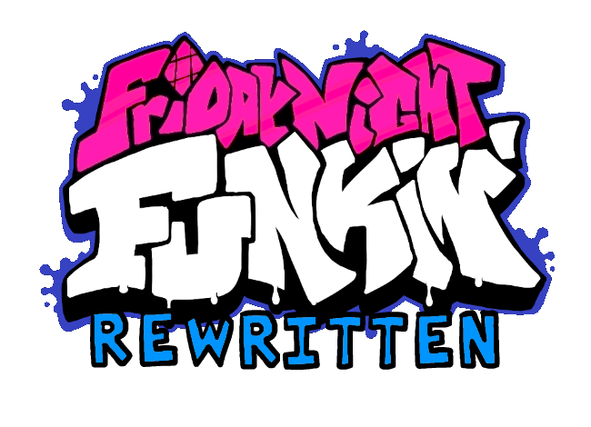

# 
     

Friday Night Funkin' Rewritten is a rewrite of [Friday Night Funkin'](https://ninja-muffin24.itch.io/funkin) built on [LÖVE](https://love2d.org/) for Windows, macOS, Linux, and Web platforms, as well as previously unsupported platforms, like the Nintendo Switch!

Friday Night Funkin' Vanilla Engine is a modification of [Friday Night Funkin' Rewritten](https://github.com/HTV04/funkin-rewritten/releases) and should not be treated as an official download for it.

Features with Funkin' Vanilla Engine:
* Better menu
* Custom keybinds ([read here for more available binds](https://love2d.org/wiki/KeyConstant))
* A Settings menu
* Slightly better judgements
* Accuracy counter + Miss counter
* Discord RPC (Windows only)
* Week 6 dialogue
* Note splashes 
* Some Gameplay modifications
* Pausing
* Mod Folder
* Gamejolt Achievement Support
* And More!

Join Vanilla Engines's Discord server for updates and other stuff: https://discord.gg/TBF3HkXWhq

Friday Night Funkin' Rewritten features:
* A rewritten engine focused on performance and playability
* Much less memory usage than the original game
* Controller support
* Other cool features, like downscroll
* And more to come!

Join HTV04's Discord server for Funkin' Rewritten updates and discussion: [https://discord.gg/tQGzN2Wu48](https://discord.gg/TBF3HkXWhq)

# Controls
If using a controller on a PC, a controller with an Xbox button layout is recommended. Controller buttons will be remappable in a future update.

## Menus
### Keyboard
* Arrow Keys - Select
* Enter - Confirm
* Escape - Back

### Controller
* Left Stick/D-Pad - Select
* A - Confirm
* B - Back

## Game
### Keyboard
* WASD/Arrow Keys - Arrows/Special keybinds defined by you! (in the settings.ini)
* Enter - Confirm (Game Over)
* Escape - Exit

### Controller
* Left Stick/Right Stick/Shoulder Buttons/D-Pad/ABXY - Arrows
* A - Confirm (Game Over)
* Start - Exit

## Debug
### Keyboard
* 6 - Take screenshot
  * Screenshot paths:
    * Windows - `%APPDATA%\vanilla-engine\screenshots`
    * macOS - `~/Library/Application Support/vanilla-engine/screenshots`
	* Linux - `~/.local/share/love/vanilla-engine/screenshots`
	* Nintendo Switch - `./vanilla-engine/screenshots`
* 7 - Open debug menu

# Settings
The settings file can be found in the following places on the following systems:
* Windows - `%APPDATA%\vanilla-engine\settings.ini` & `%APPDATA%\vanilla-engine\settings`
* macOS - `~/Library/Application Support/vanilla-engine/settings.ini` & `~/Library/Application Support/vanilla-engine/settings`
* Linux - `~/.local/share/love/vanilla-engine/settings.ini` & `~/.local/share/love/vanilla-engine/settings`
* Nintendo Switch - `./vanilla-engine/settings.ini` & `./vanilla-engine/settings`

# Progress
**Menus** - 95% Complete
* The menu is almost done, just need to clean up some code and add transitions

**Game Engine** - 95% Complete
* A few more small changes are stil needed, but its very close

**Weeks** - ~7/9 Complete
* Tutorial + Weeks 1-7 are implemented.
* Week 3's train is not implemented yet.
* Week 4's passing car is not implemented yet.
* Weeks 7's Tankmen running and Tank is not implemented yet.

# License
*Friday Night Funkin' Rewritten* is licensed under the terms of the GNU General Public License v3, with the exception of most of the images, music, and sounds, which are proprietary. While FNF Rewritten's code is FOSS, use its assets at your own risk.

Also, derivative works (mods, forks, etc.) of FNF Rewritten must be open-source. The build methods shown in this README technically make one's code open-source anyway, but uploading it to GitHub or a similar platform is advised.

# Building
Web build instructions coming soon! Current method isn't that portable right now, but I'm working on something.

## Unix-like (macOS, Linux, etc.)
After running a build method, its release ZIP will be located at `./build/release`.

### LOVE file
* Run `make lovefile`

### Windows (64-bit)
* Set up dependencies shown in `./resources/win64/dependencies.txt`
* Run `make win64`

### Windows (32-bit)
* Set up dependencies shown in `./resources/win32/dependencies.txt`
* Run `make win32`

### macOS
* Set up dependencies shown in `./resources/macos/dependencies.txt`
* Run `make macos`

### Nintendo Switch
* Set up [devkitPro](https://devkitpro.org/wiki/Getting_Started)
  * Install the `switch-dev` package
* Set up dependencies shown in `./resources/switch/dependencies.txt`
* Run `make switch`

### Desktop Platforms
* Set up dependencies shown in `./resources/win64/dependencies.txt`
* Set up dependencies shown in `./resources/win32/dependencies.txt`
* Set up dependencies shown in `./resources/macos/dependencies.txt`
* Run `make desktop`

### Console Platforms
* Set up [devkitPro](https://devkitpro.org/wiki/Getting_Started)
  * Install the `switch-dev` package
* Set up dependencies shown in `./resources/switch/dependencies.txt`
* Run `make console`

### All Platforms
* Set up dependencies shown in `./resources/win64/dependencies.txt`
* Set up dependencies shown in `./resources/win32/dependencies.txt`
* Set up dependencies shown in `./resources/macos/dependencies.txt`
* Set up [devkitPro](https://devkitpro.org/wiki/Getting_Started)
  * Install the `switch-dev` package
* Set up dependencies shown in `./resources/switch/dependencies.txt`
* Run `make`

## Other
Follow the official instructions for LÖVE game distribution for your platform: https://love2d.org/wiki/Game_Distribution

# Special Thanks
* [PHANTOMCLO](https://twitter.com/PHANTOMCLO) for the pixel note splashes
* [Keoiki](https://twitter.com/Keoiki_) For the Note splashes used in weeks 1-5
* [HTV04](https://github.com/HTV-4) For developing Funkin Rewritten
* KadeDev for [FNFDataAPI](https://github.com/KadeDev/FNFDataAPI), which was refrenced while developing the chart-reading system
* The developers of [BeatFever Mania](https://github.com/Sulunia/beatfever) for their music time interpolation code
* The developers of the [LÖVE](https://love2d.org/) framework, for making Funkin' Rewritten possible
* p-sam for developing [love-nx](https://github.com/retronx-team/love-nx), used for the Nintendo Switch version of the game
* Davidobot for developing [love.js](https://github.com/Davidobot/love.js), used for the Web version of the game
* TurtleP for developing [LÖVE Potion](https://github.com/lovebrew/LovePotion), originally used for the Nintendo Switch version of the game
* Funkin' Crew (ninjamuffin99, PhantomArcade, kawaisprite, and evilsk8er), for making such an awesome game!
* Getsaa for making our amazing menu assets
